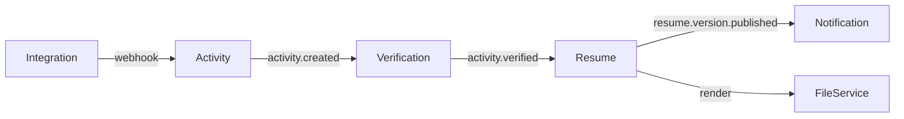

# The Problem with Static Resumes

We treat resumes as static PDFs that become outdated the moment we hit "Save". In the age of verified online learning, GitHub contributions, and hackathons, why do we manually type out achievements?

I decided to build a system that *listens* to your achievements and *automatically* updates your resume.

# The Architecture

The **Resume Ecosystem** is a monorepo containing 8 microservices, built with **Node.js 20**, **TypeScript**, and **Kafka**.



## Key Technical Decisions

### 1. Event-Driven (Kafka) vs REST

Instead of services calling each other synchronously (and failing together), I used **Kafka** for loose coupling.

*   When an activity is created, the **Activity Service** emits an event. It doesn't care who listens.
*   The **Verification Service** picks it up, validates the data (e.g., checks a hash or OAuth token), and emits `activity.verified`.
*   The **Resume Service** listens for verified activities and re-scores the resume.

This allows the system to scale independently. Verification logic can be slow without blocking the user's dashboard.

### 2. Fastify & Prisma

I chose **Fastify** for its low overhead and robust plugin system. **Prisma** handles database access with type-safe queries, making refactoring much safer across microservices.

### 3. Verification Logic

We implement multiple verification strategies:

*   **Hash**: Compare SHA-256 of a certificate/artifact.
*   **OAuth**: Verify identity via GitHub/LinkedIn.
*   **Webhooks**: Trust data directly from partner platforms (e.g., Coursera).

Results are cached in **Redis** (LRU) to avoid re-verifying frequently accessed data.

# Resume Scoring Algorithm

One of the coolest features is the **dynamic scoring**. An algorithm ranks activities based on:

1.  **Trust Level** (Verified > Manual)
2.  **Impact Score** (Self-reported or calculated)
3.  **Recency** (Exponential decay)

This ensures the most relevant and impressive achievements float to the top of your resume automatically.

```typescript
const score = base * 0.5 + 
              (trust / 100) * 0.3 + 
              Math.log(1 + Math.max(0, impact)) * 0.2 + 
              5 * Math.exp(-(daysSinceEnd || 0) / 365);
```

# What I Learned

Building a distributed system is complex. Ensuring data consistency across services (e.g., if Resume Service fails to consume an event) requires careful error handling and dead-letter queues (DLQs), which are on the roadmap.

Also, **Docker Compose** is a lifesaver for spinning up local dev environments with Kafka, Zookeeper, Redis, and Postgres in one command.

# Join the Project! 🚀

The project is fully open source. I'm actively looking for contributors to help with:

*   Frontend improvements (React + Vite)
*   More verification strategies (e.g., LeetCode, HackerRank)
*   Kubernetes deployment charts

Check it out on GitHub: [https://github.com/srivilliamsai/resume-ecosystem-node](https://github.com/srivilliamsai/resume-ecosystem-node)

Stars and feedback are much appreciated! ⭐
